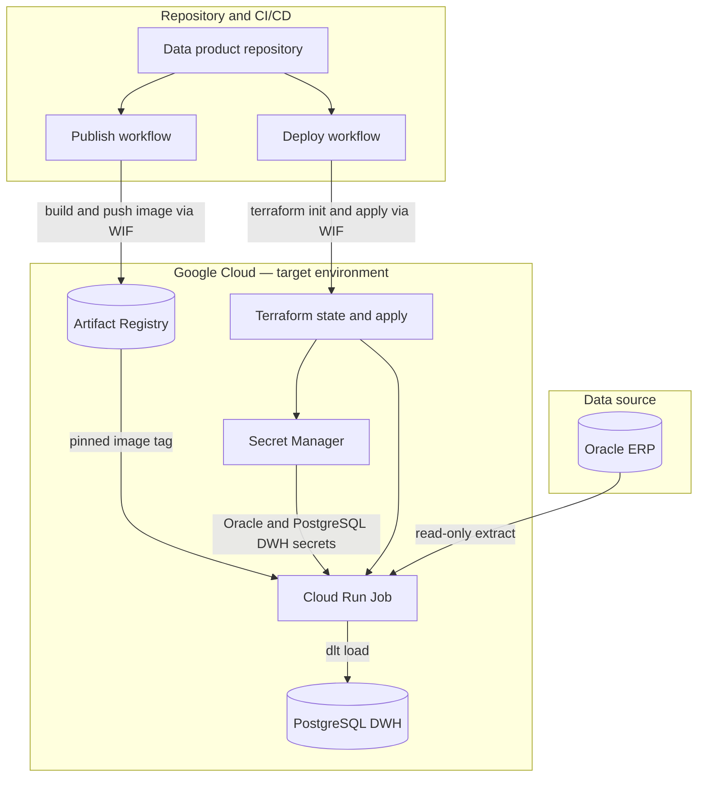

# Blueprint: Oracle ERP → PostgreSQL DWH ingest (DPDS-driven)

## What this blueprint is about

The blueprint defines a **governed ingest** on **Google Cloud**: read-only **Oracle ERP** extracts (one or more schemas, same logical table) flow through a containerized runner into a **PostgreSQL data warehouse**, with **Secret Manager** credentials, **Terraform** infrastructure, and **GitHub Actions** for build and deploy.

The **Python** application implements a fixed pipeline (extract → your transform hook → JSON Schema validation → **dlt** load). After you instantiate a data product from this blueprint, **business column mapping** lives in `application/transform_hook.py`.

## Data product use case

**Problem:** You need a repeatable pattern to land Oracle ERP data into a PostgreSQL DWH under a **single output contract**, with infrastructure and delivery aligned to **environments** (for example `dev`, `prod`). Both the ERP and the DWH run inside the same GCP estate (for example Compute Engine VMs or Cloud SQL).

**Out of scope for the blueprint itself:** Detailed business rules (those live in the hook), the **output port column map** (you declare it on the instantiated descriptor), provisioning the remote Terraform state bucket, provisioning the Oracle ERP or PostgreSQL DWH instances themselves, and automatic reconciliation of every possible source column to the output without your hook logic.

### High-level architecture

At runtime the **Cloud Run Job** runs the containerized pipeline. **Publish** delivers the image; **Deploy** applies Terraform per environment. Credentials never live in the repo.

## How to use this blueprint

1. **Instantiate** a data product from this blueprint and supply the GCP, Oracle, and PostgreSQL parameters declared in the [manifest](blueprint-manifest.yaml). You get a complete repository: descriptor, ingest application, Terraform, and CI workflows.

2. **Define the output contract** in the rendered descriptor (the column map on the PostgreSQL output port). The runner validates every transformed row against that contract.

3. **Implement `application/transform_hook.py`** so extracted Oracle rows match that contract. Keep mapping here; the rest of the runner is generic.

4. **Confirm secrets** in Secret Manager (read-only Oracle access, write access to the DWH schema) match the ids used at deploy time.

5. **Publish, then deploy.** Publish builds and pushes an immutable runner image. Deploy applies Terraform for one environment and pins the Cloud Run Job to that image.

6. **Run or schedule** the Cloud Run Job to execute an ingest. When the output shape changes, update the descriptor column map and the hook together, then publish and redeploy.

## Data product lifecycle

### Instantiation

The platform renders parameterized templates (descriptor, workflows, product README, Terraform backend) and copies the rest of the scaffold into the new data product repository. From that point the product team owns the hook and the output column map.

### Publication

**Publish** builds and pushes the ingest runner image to Artifact Registry. It does not apply Terraform. Operators later deploy each environment with that image tag.

### Deployment

**Deploy** applies Terraform for **one** environment and **one** already published image. That creates or updates the Cloud Run Job (and the IAM needed to read the secrets). After a successful deploy, run the job on demand or from a scheduler.

## Where to go next

- **Python pipeline and modules:** [`application/README.md`](../application/README.md)
- **Parameters collected at instantiation:** [`blueprint-manifest.yaml`](blueprint-manifest.yaml)
- [DPDS](https://dpds.opendatamesh.org/specifications/dpds/)
